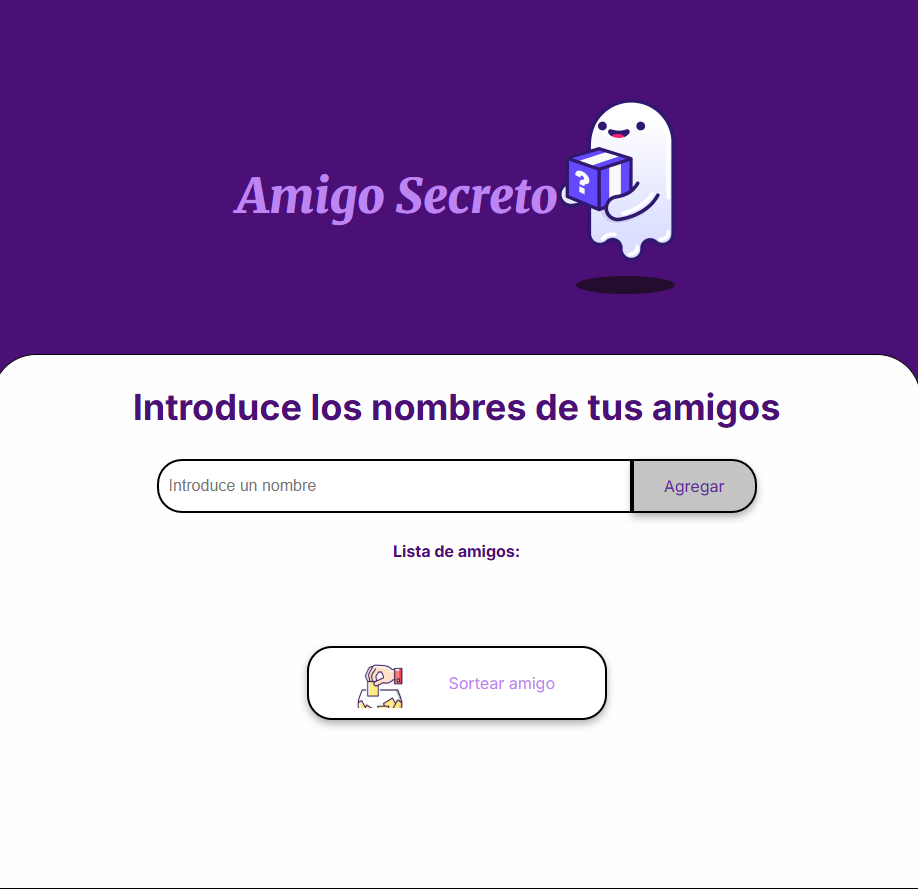

# PROYECTO DESAFÍO AMIGO SECRETO MAIN ALURA ONE
## EL OBJETIVO DE ESTE PROYECTO:
###  DESARROLLAR UNA APLICACIÓN DE SORTEO DE AMIGOS SECRETOS

### FINALIDAD DE LA APLICACIÓN

#### INSTRUCCIONES PARA UTILIZAR LA APLICACIÓN:
- EL USUARIO ACCEDERÁ A LA APP
- INGRESE EL NOMBRE DE LAS PERSONAS A SORTEAR
- HAGA CLIC EN AÑADIR
- EL USUARIO REPETIRÁ LA ACCIÓN HASTA HABER AÑADIDO A TODOS LOS AMIGOS
- FINALMENTE HARÁS CLIC EN SORTEAR AMIGOS
- LA APLICACIÓN MOSTRARA EL NOMBRE DEL AMIGO SECRETO EN LA PANTALLA

#### CON QUÉ FUE CONSTRUIDO

 |  |  |  |

ENLACE DEL PROYECTO:
https://challenge-amigo-secreto-ruby-ten.vercel.app
